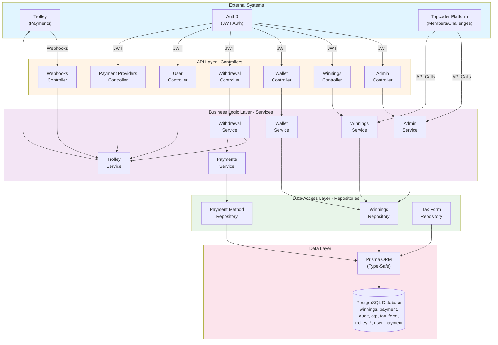
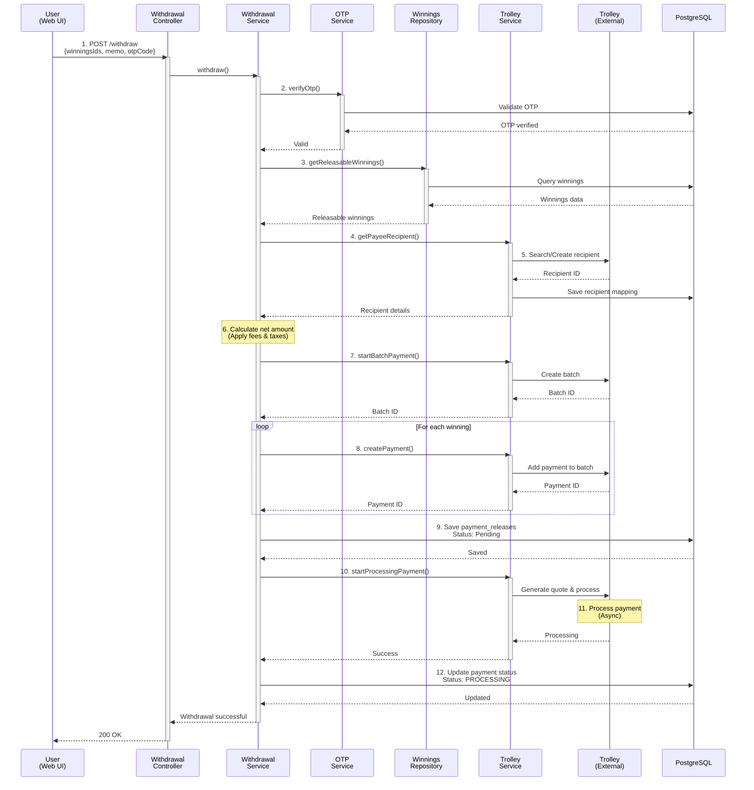
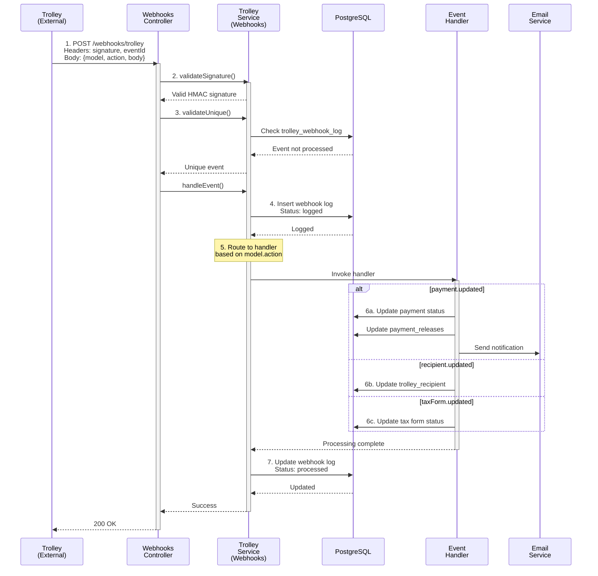
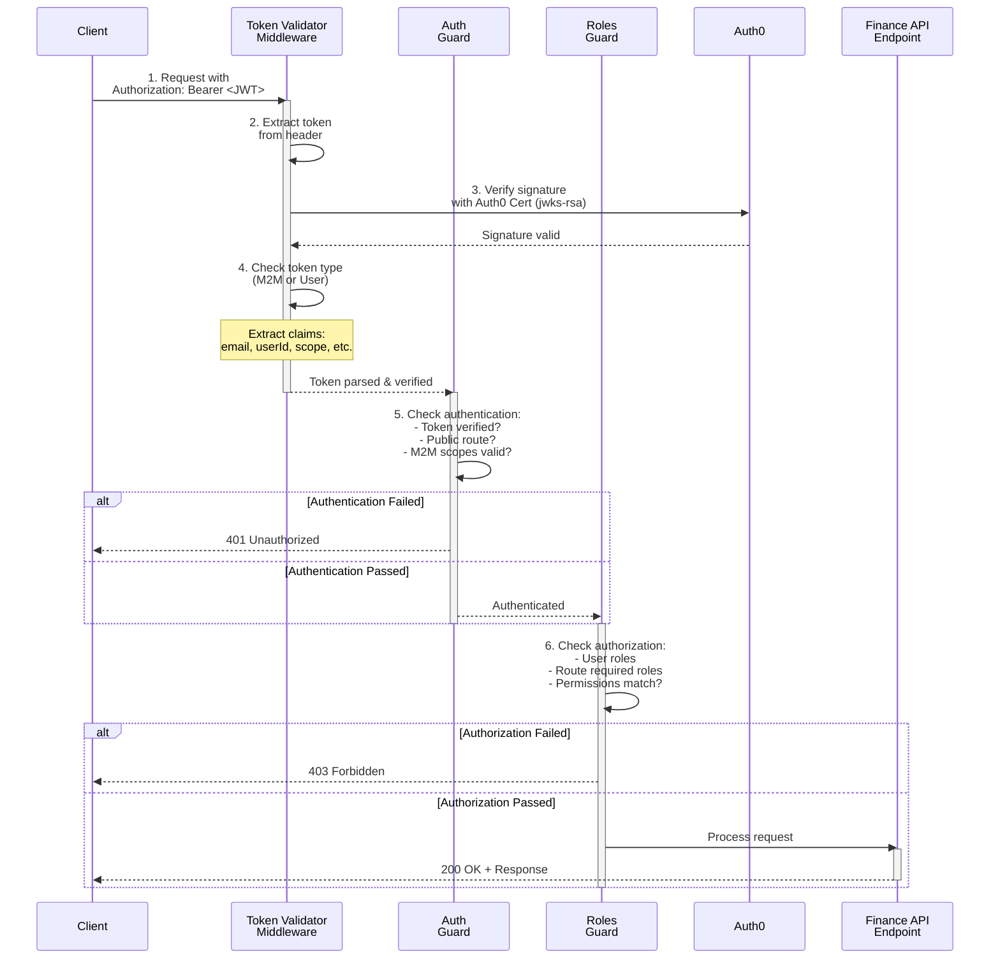
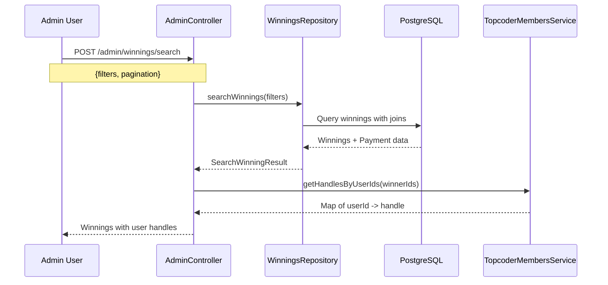
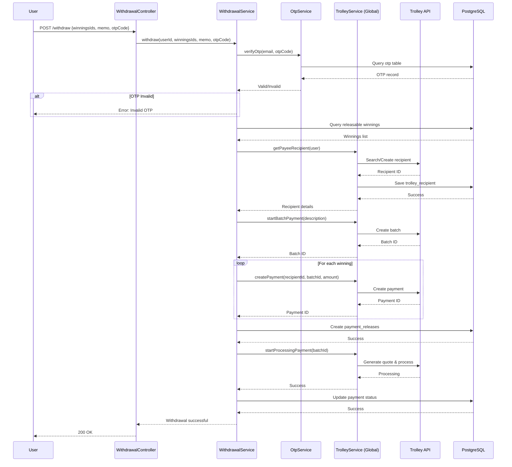
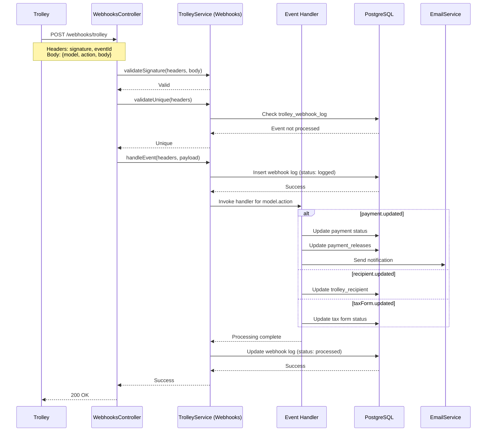

# Architecture Documentation

## Table of Contents

- [High-Level Architecture](#high-level-architecture)
- [System Components](#system-components)
- [Data Flow](#data-flow)
- [Sequence Diagrams](#sequence-diagrams)
- [Technology Stack](#technology-stack)
- [Integration Points](#integration-points)

## High-Level Architecture

The Topcoder Finance API follows a **layered architecture** pattern with clear separation of concerns:

## System Components

### 1. API Layer (Controllers)

Controllers handle HTTP requests and route them to appropriate services:

**AdminController** (`/v5/finance/admin`)

- Payment administration operations
- Winnings search and export
- Audit log retrieval
- Requires: `PaymentAdmin`, `PaymentEditor`, or `PaymentViewer` roles

**WinningsController** (`/v5/finance/winnings`)

- User winnings CRUD operations
- View personal winnings history
- Requires: `User` role

**WithdrawalController** (`/v5/finance/withdraw`)

- Initiate withdrawal requests
- Validate OTP codes
- Process payment releases
- Requires: `User` role

**WalletController** (`/v5/finance/wallet`)

- Get wallet balance
- View transaction history
- Requires: `User` role

**PaymentProvidersController** (`/v5/finance/payment-providers`)

- Trolley portal URL generation
- Payment method management
- Requires: `User` role

**WebhooksController** (`/v5/finance/webhooks`)

- Receive Trolley webhook events
- Public endpoint with signature verification
- No authentication required (validated via HMAC)

### 2. Business Logic Layer (Services)

**AdminService**

- Update winnings details
- Retrieve audit logs
- Manage payment statuses

**WinningsService**

- Create and manage winnings
- Query winnings data
- Apply business rules

**WithdrawalService**

- Process withdrawal requests
- Create Trolley payment batches
- Handle payment releases
- Calculate fees and taxes

**WalletService**

- Calculate available balance
- Aggregate payment data
- Track pending withdrawals

**TrolleyService (Global)**

- Core Trolley SDK wrapper
- API client management
- Payment batch operations
- Recipient management

**TrolleyService (PaymentProviders)**

- User-facing Trolley operations
- Recipient creation and linking
- Portal URL generation

**TrolleyService (Webhooks)**

- Webhook signature validation
- Event processing and routing
- Database logging

**PaymentsService**

- Payment processing logic
- Fee calculations
- Payment method validation

### 3. Data Access Layer (Repositories)

**WinningsRepository**

- Complex winnings queries with filters
- Pagination and sorting
- Join operations with payments

**PaymentMethodRepository**

- Payment method CRUD
- User payment method associations

**TaxFormRepository**

- Tax form management
- Status tracking

**OriginRepository**

- Origin/source tracking
- Reference data

### 4. Core Modules

**Authentication & Authorization**

- `AuthGuard` - JWT token validation
- `RolesGuard` - Role-based access control
- `TokenValidatorMiddleware` - Token parsing and extraction
- Supports both user JWT and M2M tokens

**Request Context**

- `CreateRequestStoreMiddleware` - Async local storage for request context
- Provides user info across the request lifecycle

**Shared Services**

- `PrismaService` - Database client
- `OtpService` - One-time password generation and validation
- `TopcoderMembersService` - Member API integration
- `TopcoderChallengesService` - Challenge API integration
- `TopcoderEmailService` - Email notifications
- `Logger` - Winston-based logging

## Data Flow

### 1. Withdrawal Request Flow

### 2. Webhook Event Processing Flow

### 3. Authentication Flow

## Sequence Diagrams

### Admin Winnings Search

### User Withdrawal Request

### Trolley Webhook Processing

## Technology Stack

### Backend Framework

- **NestJS v11.1.7** - Modular, scalable Node.js framework
  - Dependency Injection
  - Decorators for routing, validation, guards
  - Module-based architecture

### Language

- **TypeScript v5.9.3** - Type-safe JavaScript
  - Strong typing for DTOs and entities
  - Compile-time error checking
  - Enhanced IDE support

### Database Layer

- **PostgreSQL v16** - Relational database
  - ACID compliance
  - Complex queries with joins
  - Transactional support
- **Prisma v6.18.0** - Modern ORM
  - Type-safe database client
  - Schema migrations
  - Query builder
  - Database introspection

### Authentication

- **Auth0** - Identity platform
  - JWT token-based authentication
  - M2M (Machine-to-Machine) support
  - RSA signature verification (jwks-rsa)
- **jsonwebtoken v9.0.2** - JWT handling
  - Token parsing and validation
  - Signature verification

### Payment Integration

- **Trolley SDK v1.1.0** - Payment provider
  - Recipient management
  - Batch payments
  - Webhook events
  - International payouts

### API Documentation

- **Swagger/OpenAPI** - Interactive API docs
  - Auto-generated from decorators
  - Try-it-out functionality
  - Schema definitions

### Validation

- **class-validator v0.14.2** - DTO validation
  - Decorator-based validation rules
  - Automatic request validation
- **class-transformer v0.5.1** - Object transformation
  - Plain object to class instance
  - Type coercion

### Logging

- **Winston v3.18.3** - Logging framework
  - Structured logging
  - Multiple transports
  - Log levels

## Integration Points

### 1. Trolley Payment Provider

**Purpose**: Process international payments to members

**Integration Type**: REST API + Webhooks

**Key Operations**:

- Create/manage recipients
- Create payment batches
- Process payments
- Handle webhook events

**Authentication**: API Key + Secret (HMAC for webhooks)

**Endpoints Used**:

- `POST /recipients` - Create recipient
- `GET /recipients/search` - Find recipient
- `POST /batches` - Create payment batch
- `POST /batches/{id}/payments` - Add payment
- `POST /batches/{id}/generate-quote` - Generate quote
- `POST /batches/{id}/start-processing` - Start processing

**Webhook Events**:

- `payment.updated` - Payment status changed
- `recipient.updated` - Recipient info updated
- `taxForm.updated` - Tax form status changed
- `recipientAccount.created/updated` - Payment method added

### 2. Auth0 Identity Platform

**Purpose**: User authentication and authorization

**Integration Type**: JWT token validation

**Key Operations**:

- Validate JWT signatures
- Extract user claims
- Verify M2M tokens
- Check scopes and roles

**Authentication**: RSA Public Key (AUTH0_CERT)

**Token Types**:

- User JWT: Contains email, handle, userId
- M2M JWT: Contains scope and clientId

### 3. Topcoder Platform APIs

**Purpose**: Member and challenge data

**Integration Type**: REST API (M2M)

**Key Operations**:

- Get member profile data
- Fetch user handles
- Update challenge payment status
- Send email notifications

**Authentication**: Auth0 M2M token

**APIs Used**:

- Members API: `/v5/members/{handle}`
- Challenges API: `/v5/challenges/{id}`
- Email Service: Kafka bus messages

### 4. Database (PostgreSQL)

**Purpose**: Persistent data storage

**Integration Type**: Prisma ORM

**Key Tables**:

- `winnings` - Member earnings
- `payment` - Payment records
- `payment_releases` - Batch releases
- `trolley_recipient` - Trolley mappings
- `user_payment_methods` - Payment methods
- `trolley_webhook_log` - Webhook tracking
- `audit` - Audit trail
- `otp` - One-time passwords

**Connection**: Connection pooling via Prisma

## Security Considerations

### Authentication & Authorization

- All endpoints require authentication
- Role-based access control (RBAC)
- JWT signature verification
- M2M token scope validation

### Webhook Security

- HMAC signature validation
- Replay attack prevention (event ID tracking)
- IP allowlisting (optional)

### Data Protection

- Sensitive data encrypted at rest
- HTTPS/TLS for all communications
- OTP for withdrawal operations
- Audit logging for all critical operations

### Input Validation

- DTO validation using class-validator
- SQL injection prevention via Prisma
- XSS protection via input sanitization
- Rate limiting (via infrastructure)

## Scalability & Performance

### Horizontal Scaling

- Stateless API design
- No session storage
- Can run multiple instances

### Database Optimization

- Indexed columns for common queries
- Efficient joins via Prisma
- Connection pooling
- Read replicas (future)

### Caching Strategy

- No application-level caching currently
- Database query caching

### Async Processing

- Webhook processing is async
- Payment batch processing is async
- Email notifications are async (Kafka)

## Error Handling

### Application Errors

- NestJS exception filters
- Structured error responses
- Error logging via Winston

### External Service Failures

- Retry logic for Trolley API
- Graceful degradation
- Error status tracking

### Database Errors

- Transaction rollback on failure
- Prisma error handling
- Connection retry logic

## Monitoring & Observability

### Logging

- Winston structured logging
- Log levels: error, warn, info, debug
- Request/response logging
- Webhook event logging
